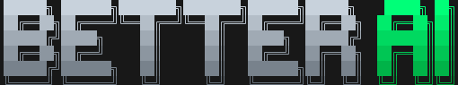

<div align="center">



</div>
<div align="center">

[](https://www.npmjs.com/package/bttrai) [](https://www.npmjs.com/package/bttrai) [](https://www.npmjs.com/package/bttrai) [](https://npmx.dev/package/bttrai)

</div>

## Overview

A CLI that auto-installs MCP servers and skills to your agent(s) based on your project's stack. It uses [skills](https://github.com/vercel-labs/skills) and [add-mcp](https://github.com/neondatabase/add-mcp) CLIs under the hood.

## Why better-ai

This initially started because I was too lazy to add individual skills and MCP installs for my individual projects, and as a result I was unnecessarily inflating my context window by installing everything globally. As I was building this, I hope this project will provide a way to **democratize** and **standardize** development with AI. The standardization part will require community support to maintain a legit list/registry of MCPs and skills. Check out the [contributing guide](.github/CONTRIBUTING.md) for more info. I used the following sources to build the registry of MCPs and skills:

- [Aman's list in create-better-t-stack](create-better-t-stack)
- [Vercel's official skills registry](https://skills.sh/official)
- Manual search

## Usage

```bash

# Run the full install flow
npx bttrai

# Install for a different project directory
npx bttrai --project ./my-app

# Auto-approve install for specific agents
npx bttrai --auto --agent cursor claude-code

# Install only skills
npx bttrai --skills

# Install only MCP servers
npx bttrai --mcp

# Detect what matches the current project
npx bttrai detect

# Output JSON for scripts/automation
npx bttrai detect --json

```

### Commands

| Command          | Description                                           |
| ---------------- | ----------------------------------------------------- |
| `bttrai`         | Default install flow                                  |
| `bttrai detect`  | Detect matching MCP servers and skills                |
| `bttrai install` | Run the install flow explicitly - this is the default |

### Options

| Option             | Applies to          | Description                                   |
| ------------------ | ------------------- | --------------------------------------------- |
| `--help`           | all commands        | Show command usage and available options      |
| `--project <path>` | `detect`, `install` | Target a different project directory          |
| `--json`           | `detect`, `install` | Output machine-readable JSON                  |
| `--auto`           | `install`           | Skip prompts and auto-select detected matches |
| `--agent <name>`   | `install`           | Choose one or more agents to install into     |
| `--skills`         | `install`           | Only include skills                           |
| `--mcp`            | `install`           | Only include MCP servers                      |

> [!Note]
>
> - `--auto` requires at least one `--agent`.
> - If your project prefers `bun`, `pnpm`, `yarn`, or `deno` but that runner is not available, `bttrai` falls back to `npx` automatically.

## Future features

- [ ] More MCPs
- [ ] Better python support
- [ ] Presets - you can define presets you like, for example a frontend preset with the Shadcn MCP with impeccable and UI/UX pro skill
- [ ] More languages
- [ ] Maybe a better way to contribute to registries
- [ ] Skills + CLI alternative to MCPs
